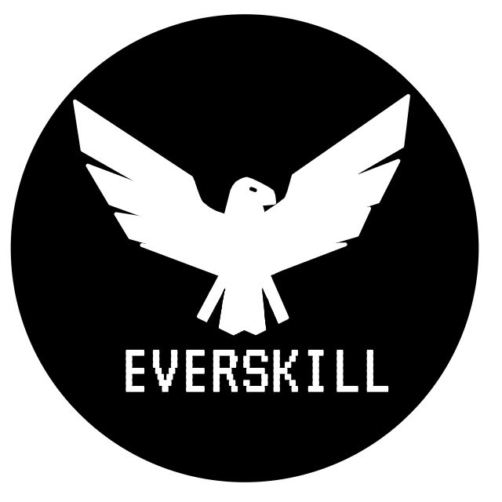

Everskill is an open-source, universal skill learning platform which is inspired by Duolingo. It uses principles from games and social media to make learning your dream skill fun (and kind of addictive too).

# Roadmap
See the project log [here](project-log.md)!

## Completed Tasks (Last 16 only)
For more info, look at the [project log](./project-log.md).

- [x] Get things sorted (assignees: [n3rdium](https://github.com/n3rdium))
- [x] Write a basic backend (assignees: [n3rdium](https://github.com/n3rdium))
- [x] Backend: Plan system design for course integration (assignees: [n3rdium](https://github.com/n3rdium))
- [x] Fix backend bug: last question in a quiz not awarding points (assignees: [n3rdium](https://github.com/n3rdium))
- [x] Create a course search feature because why not (assignees: [n3rdium](https://github.com/n3rdium))
- [x] Make public user profiles (assignees: [n3rdium](https://github.com/n3rdium))
- [x] Make a streak system (assignees: [n3rdium](https://github.com/n3rdium))
- [x] Create the profile settings page (assignees: [n3rdium](https://github.com/n3rdium))

## TODO
- [ ] [IMPORTANT] *Start* writing the frontend (assignees: [!WANTED: SOMEONE INTO FRONTEND])
- [ ] Start working on the basic code for the course items: (assignees: [chet](https://github.com/chet-ag09))
- [ ] Make anticheat! (assignees: [n3rdium](https://github.com/n3rdium) [!WANTED: SOMEONE INTO FRONTEND])
- [ ] Make a leaderboard (assignees: [n3rdium](https://github.com/n3rdium))
- [ ] Create a way to change passwords (assignees: [n3rdium](https://github.com/n3rdium))

# Motivation
We were inspired to make this platform by the creator of Duolingo. For more details, you can watch his Ted talk (linked below)

